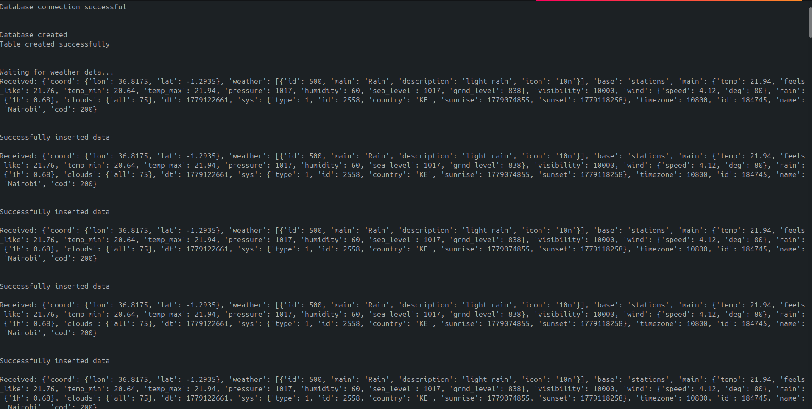
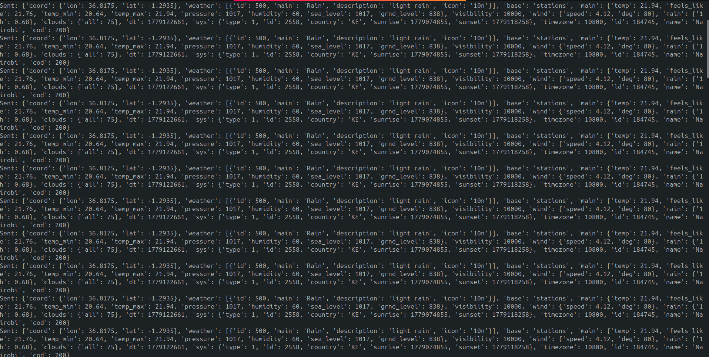

# OpenWeather Real-Time Streaming Pipeline 

This project extracts live weather data from the OpenWeather API, streams it via an Apache Kafka broker, transforms it and loads the cleaned data into an Apache Cassandra cluster.

## Project Architecture
1. **Producer (`producer.py`)**: Fetches real-time JSON payloads from the OpenWeather API and publishes them to the Kafka topic `weather-info`.

2. **Broker (`KRaft`)**: Facilitates message ingestion.

3. **Consumer (`consumer.py`)**: Receives data from the producer, applies data type transformations and inserts the data into Cassandra.

4. **Database (Cassandra)**: Stores the wide-row transactional weather data in the `weather_info` keyspace.

## Prerequisites
Ensure you have the following services and environments configured on your machine:

* **Java Runtime:** OpenJDK 11 for Cassandra and OpenJDK 21 for Kafka

* **Python:** Version 3.10 to 3.12 

* **Apache Kafka:**  Version 4.2

* **Cassandra:** Local instance database

## Installation & Setup
### 1. Clone the Project & Configure Environment
Navigate to your project directory, activate your virtual environment and install the required dependencies:
```Bash
cd open_weather_streaming
source venv/bin/activate
pip install kafka-python cassandra-driver requests python-dotenv pandas cqlsh
```
Create a .env file in the root directory to store your OpenWeather API endpoint securely:
```Plaintext
# .env
url=https://api.openweathermap.org/data/2.5/weather?q=Nairobi&appid=YOUR_API_KEY_HERE&units=metric
```

### 2. Initialize Kafka
```Bash
# Generate a cluster ID and format storage
KAFKA_CLUSTER_ID="$(bin/kafka-storage.sh random-uuid)"
bin/kafka-storage.sh format --standalone -t $KAFKA_CLUSTER_ID -c config/server.properties

# Start the Kafka Broker
bin/kafka-server-start.sh config/server.properties
```

### 3. Initialize Cassandra
Ensure your local Cassandra service is fully booted and listening on its default client port (9042):
```Bash
# Start the service if inactive
sudo systemctl start cassandra

# Verify the node status is Up before running scripts
nodetool status
```

## Workflow
Run the consumer first to create the target schema in Cassandra then run the producer stream in another terminal.

### Step 1: Run the Consumer
The consumer will connect to Cassandra, auto-generate the keyspace `weather_info`, build the `weather_data` table, and stand by for message offsets:

```Bash
python3 consumer.py
```
Screenshot:


### Step 2: Run the Producer
In a separate terminal session, run the producer script to start feeding data into Kafka:

```Bash
python3 producer.py
```


### Step 3: Query Data
To inspect the data loaded into the database, use the `cqlsh` cli tool inside your environment:

```Bash
# Enter the Cassandra shell 
cqlsh

# Navigate to the target keyspace
cqlsh> USE weather_info;

# Verify records are populating
cqlsh:weather_info> EXPAND ON; SELECT * FROM weather_data LIMIT 1;
Now Expanded output is enabled

@ Row 1
---------------------+---------------------------------
 id                  | 184745
 base                | stations
 city                | Nairobi
 cloud_percentage    | 75
 country             | KE
 ground_level        | 839
 humidity            | 77
 latitude            | -1.292
 longitude           | 36.8219
 main_weather        | Clouds
 pressure            | 1018
 sea_level           | 1018
 status_code         | 200
 sunrise             | 2026-05-18 06:27:33.000000+0000
 sunset              | 2026-05-18 18:30:57.000000+0000
 temp                | 18.71
 temp_feels_like     | 18.65
 temp_max            | 18.71
 temp_min            | 18.71
 timezone            | 10800
 visibility          | 10000
 weather_description | broken clouds
 weather_id          | 803
 wind_direction      | 46
 wind_speed          | 1.46

```

